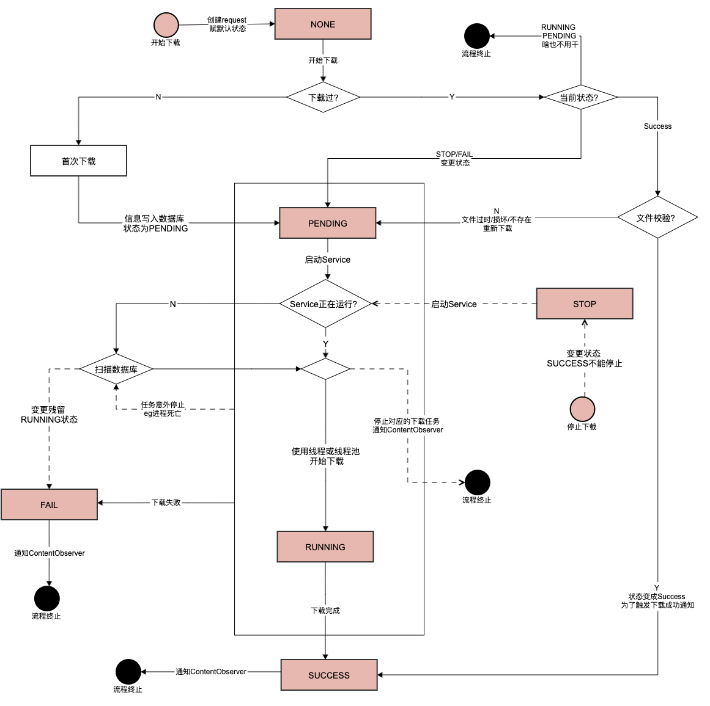

[TOC]

# 介绍

下载地址：

截屏

# 背景

熟悉ThreadPoolExcutor源码

下载/上传的工具模块，支持断点续传，分片下载，内存文件映射。
应用四大组件、数据库。··1··
编写demo，单元测试，和设计文档
应用设计模式

加密解密

# 需求概述


# 骨架

借鉴DownloadManager，其基本实现思路如下图


开始下载至下载完成的时序图


状态图



## service

定时器查看 map==空

同步 队列

异步 线程池队列

线程池：核心线程可以回收 ， 拒绝策略

 暴露 eqeue(call). execute(call) cancel()  

ThreadPoolExecutor:有些线程不想在用了Looper，无法知道线程池是否空闲，futureTask cancel()不掉

任务队列  worker 对线程的封装	

ReentrantLock 基于其内部类Sync实现。Sync继承AQS


无任务 destory  

Worker      workQueue任务队列

```
HashSet<Worker> workers 》worker的 Runnable firstTask;
BlockingQueue<Runnable> workQueue;
```


firstTask=null

任务执行

执行完去队列再拿


AbstractQueuedSynchronizer

state作为锁，几个线程去访问它

线程由链表保存，表头可以运行。其他用LockSupport阻塞

表头运行完了，下一个结点运行

```java
class AbstractQueuedSynchronizer{// 阻塞使用LockSupport
		void acquire(int arg) // 获得锁，lock()的底层实现。status的值加1
    boolean release(int arg) // 释放锁，unlock()的底层实现。status的值减1。调用tryRelease
    // 返回true，那么就是获取锁成功；如果返回false，那么就是未获得锁，需要加入阻塞等待队列。
		boolean tryAcquire(int arg)	// 空实现，需子类重载。可参考ReentrantLock#FairSync公平锁
		Node addWaiter(Node mode)// 存当前线程信息的节点加入到等待队列中
		boolean acquireQueued(final Node node, int arg)
    
  	boolean tryRelease(int releases) // 空实现由子类重载，释放独占性
    // 值就代表锁的有无。当state=0时，表示锁未被占有，否在表示当前锁已经被占有。
		volatile int state; // 线程独占的变量，代表抽象概念的锁.（compareAndSet+volatile）保证独占性
  	// 双向链表，保存竞争锁的thread信息。队首结点可获得state（锁），其他线程阻塞。waitStatus
  	//  1 CANCELLED：当前线程被取消；
    // -1 SIGNAL：当前节点的后继节点需要运行；
    // -2 CONDITION：当前节点在等待condition；
    // -3 PROPAGATE：当前场景下后续的acquireShared可以执行；
    //  0 默认值，当前节点在sync队列中等待获取锁。
  	static final class Node;
}
```


LockSupport

```java
LockSupport.park();
LockSupport.unpark(mThread);
```


```java
public interface Lock {

    /** 锁上，让其他线程阻塞，等锁 */
    void lock();

    /**
     * Acquires the lock unless the current thread is
     * {@linkplain Thread#interrupt interrupted}.
     *
     * <p>Acquires the lock if it is available and returns immediately.
     *
     * <p>If the lock is not available then the current thread becomes
     * disabled for thread scheduling purposes and lies dormant until
     * one of two things happens:
     *
     * <ul>
     * <li>The lock is acquired by the current thread; or
     * <li>Some other thread {@linkplain Thread#interrupt interrupts} the
     * current thread, and interruption of lock acquisition is supported.
     * </ul>
     *
     * <p>If the current thread:
     * <ul>
     * <li>has its interrupted status set on entry to this method; or
     * <li>is {@linkplain Thread#interrupt interrupted} while acquiring the
     * lock, and interruption of lock acquisition is supported,
     * </ul>
     * then {@link InterruptedException} is thrown and the current thread's
     * interrupted status is cleared.
     *
     * <p><b>Implementation Considerations</b>
     *
     * <p>The ability to interrupt a lock acquisition in some
     * implementations may not be possible, and if possible may be an
     * expensive operation.  The programmer should be aware that this
     * may be the case. An implementation should document when this is
     * the case.
     *
     * <p>An implementation can favor responding to an interrupt over
     * normal method return.
     *
     * <p>A {@code Lock} implementation may be able to detect
     * erroneous use of the lock, such as an invocation that would
     * cause deadlock, and may throw an (unchecked) exception in such
     * circumstances.  The circumstances and the exception type must
     * be documented by that {@code Lock} implementation.
     *
     * @throws InterruptedException if the current thread is
     *         interrupted while acquiring the lock (and interruption
     *         of lock acquisition is supported)
     */
    void lockInterruptibly() throws InterruptedException;

    /**
     * Acquires the lock only if it is free at the time of invocation.
     *
     * <p>Acquires the lock if it is available and returns immediately
     * with the value {@code true}.
     * If the lock is not available then this method will return
     * immediately with the value {@code false}.
     *
     * <p>A typical usage idiom for this method would be:
     * <pre> {@code
     * Lock lock = ...;
     * if (lock.tryLock()) {
     *   try {
     *     // manipulate protected state
     *   } finally {
     *     lock.unlock();
     *   }
     * } else {
     *   // perform alternative actions
     * }}</pre>
     *
     * This usage ensures that the lock is unlocked if it was acquired, and
     * doesn't try to unlock if the lock was not acquired.
     *
     * @return {@code true} if the lock was acquired and
     *         {@code false} otherwise
     */
    boolean tryLock();

    /**
     * Acquires the lock if it is free within the given waiting time and the
     * current thread has not been {@linkplain Thread#interrupt interrupted}.
     *
     * <p>If the lock is available this method returns immediately
     * with the value {@code true}.
     * If the lock is not available then
     * the current thread becomes disabled for thread scheduling
     * purposes and lies dormant until one of three things happens:
     * <ul>
     * <li>The lock is acquired by the current thread; or
     * <li>Some other thread {@linkplain Thread#interrupt interrupts} the
     * current thread, and interruption of lock acquisition is supported; or
     * <li>The specified waiting time elapses
     * </ul>
     *
     * <p>If the lock is acquired then the value {@code true} is returned.
     *
     * <p>If the current thread:
     * <ul>
     * <li>has its interrupted status set on entry to this method; or
     * <li>is {@linkplain Thread#interrupt interrupted} while acquiring
     * the lock, and interruption of lock acquisition is supported,
     * </ul>
     * then {@link InterruptedException} is thrown and the current thread's
     * interrupted status is cleared.
     *
     * <p>If the specified waiting time elapses then the value {@code false}
     * is returned.
     * If the time is
     * less than or equal to zero, the method will not wait at all.
     *
     * <p><b>Implementation Considerations</b>
     *
     * <p>The ability to interrupt a lock acquisition in some implementations
     * may not be possible, and if possible may
     * be an expensive operation.
     * The programmer should be aware that this may be the case. An
     * implementation should document when this is the case.
     *
     * <p>An implementation can favor responding to an interrupt over normal
     * method return, or reporting a timeout.
     *
     * <p>A {@code Lock} implementation may be able to detect
     * erroneous use of the lock, such as an invocation that would cause
     * deadlock, and may throw an (unchecked) exception in such circumstances.
     * The circumstances and the exception type must be documented by that
     * {@code Lock} implementation.
     *
     * @param time the maximum time to wait for the lock
     * @param unit the time unit of the {@code time} argument
     * @return {@code true} if the lock was acquired and {@code false}
     *         if the waiting time elapsed before the lock was acquired
     *
     * @throws InterruptedException if the current thread is interrupted
     *         while acquiring the lock (and interruption of lock
     *         acquisition is supported)
     */
    boolean tryLock(long time, TimeUnit unit) throws InterruptedException;

    /**
     * Releases the lock.
     *
     * <p><b>Implementation Considerations</b>
     *
     * <p>A {@code Lock} implementation will usually impose
     * restrictions on which thread can release a lock (typically only the
     * holder of the lock can release it) and may throw
     * an (unchecked) exception if the restriction is violated.
     * Any restrictions and the exception
     * type must be documented by that {@code Lock} implementation.
     */
    void unlock();

    /**
     * Returns a new {@link Condition} instance that is bound to this
     * {@code Lock} instance.
     *
     * <p>Before waiting on the condition the lock must be held by the
     * current thread.
     * A call to {@link Condition#await()} will atomically release the lock
     * before waiting and re-acquire the lock before the wait returns.
     *
     * <p><b>Implementation Considerations</b>
     *
     * <p>The exact operation of the {@link Condition} instance depends on
     * the {@code Lock} implementation and must be documented by that
     * implementation.
     *
     * @return A new {@link Condition} instance for this {@code Lock} instance
     * @throws UnsupportedOperationException if this {@code Lock}
     *         implementation does not support conditions
     */
    Condition newCondition();
}	

```

双亲代理 图片加载框架


case:只有running状态能stop，暂放在pauseDownload(Context context, Request info)

Case:完善删除状态图

case：同一个下载对象，使用不同下载方式下载。